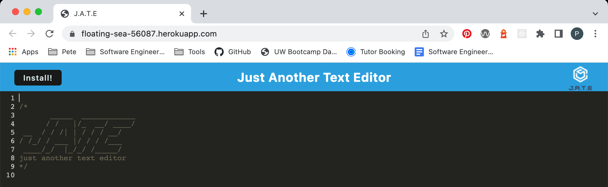
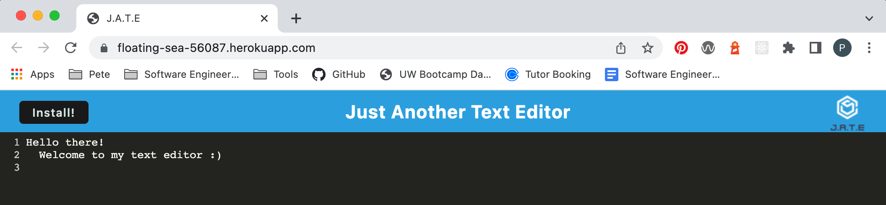

# Text Editor

Deployed Site: https://floating-sea-56087.herokuapp.com/<br>
Repo: https://github.com/425megs/text-editor
<br><br>
This text editor tool runs in the browser and can be used to save your code snippets! This single-page application features a number of data persistence techniques and will run offline. Happy writing!


## User Story

```md
AS A developer
I WANT to create notes or code snippets with or without an internet connection
SO THAT I can reliably retrieve them for later use
```

## Mock-Up

Screenshot of the default homepage:


Editor containing text:


The following image shows the application's \`manifest.json` file:


The following image shows the application's registered service worker:


The following image shows the application's IndexedDB storage:


- - -
© 2022 Trilogy Education Services, LLC, a 2U, Inc. brand. Confidential and Proprietary. All Rights Reserved.
